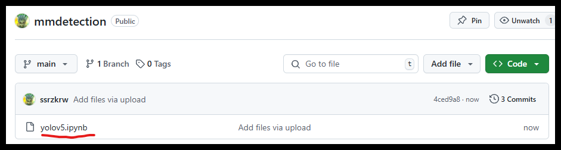
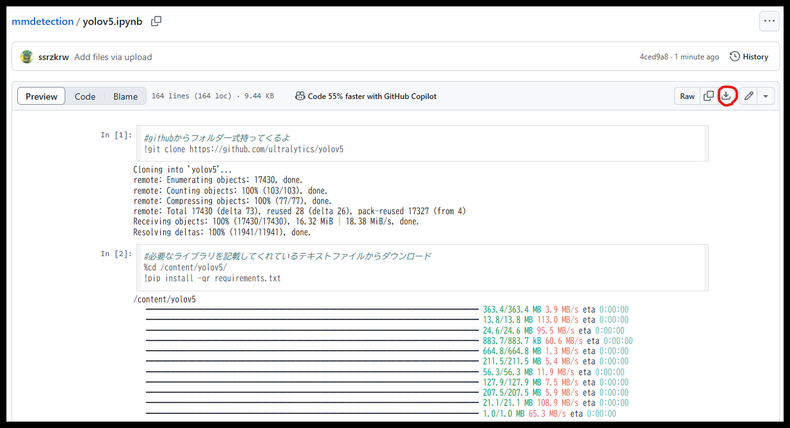
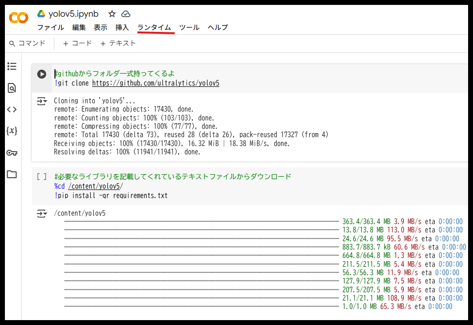
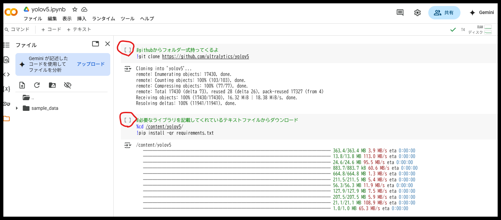
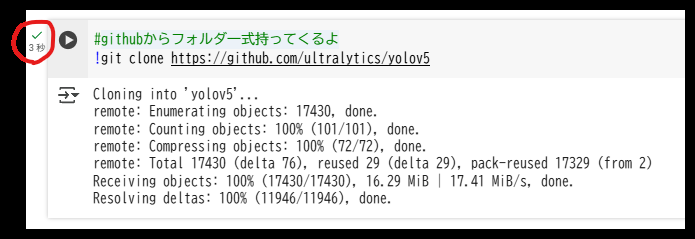

## google colabを使った物体検知
google colab：クラウド上で性能のいいGPUを使わしてくれるサービス

## 使った技術  
[yolov5](https://github.com/ultralytics/yolov5)  
[参考実装](https://laid-back-scientist.com/yolo-v5)  
  
## 実装方法  
まずは下の画像がさすファイルをクリックだ  
  

次に下の画像がさす赤丸をクリックし、ファイルをダウンロードしてくれ  
  

ダウンロード出来たらブラウザでgoogle colabと調べてくれ  
サイトを開くとこんなのがでてくるだろう 赤丸のアップロードを押してくれ  
そしたらファイルが選択できる画面になるから先ほどダウンロードしたファイルをインポートだ  
  

ファイルがインポート出来たらGPUの設定だ  
下記の写真のランタイムタブを押して「ランタイムのタイプを変更」をクリックだ  
  

そしたらT4 GPUの指定を行ってくれ  
  

実行に入るぞ  
google colabは良いパソコンをネット上で借りているような状態だ  
左のフォルダタブを押すと借りているパソコン内のフォルダを見ることができる  
  

コードが書かれている部分はいつも使っているコマンドプロンプトと同じようなものだ  
画像の赤丸の部分にカーソルを合わせると再生ボタンみたいになるだろう  
そこを押すことでコマンドを実行できる  
 

上から一つずつ再生ボタンを押して実行してほしいのだが  
必ず一つ完了してから次の再生ボタンを押すんだ  
マークは下記の赤丸のチェックがついていたら完了だ  
一番最後の再生ボタンは実行しなくてもいいぞ　推論画像が用意されてなくてエラーが出るからな  
 

最後の実行ボタンだが下記の写真のtest.jpgの部分は自分の好きな画像を用意してくれ  
.jpgの画像で頼む　人や車を学習したモデルになっているからそれらが移っている写真がいいぞ  
  

左のフォルダタブからyolov5内のimageフォルダにカーソルを合わせて右クリックだ  
アップロードという選択が出てくるからそこで自前の画像をimageフォルダ内へ入れてくれ  
画像の名前をtest.jpgに変更するか最後の実行コマンド上のtest.jpgを書き換えるかしてくれ  
  

画像が準備できたら最後の再生ボタンを押して推論実行だ  
下線の部分に実行結果画像が保存されているぞ  
  
